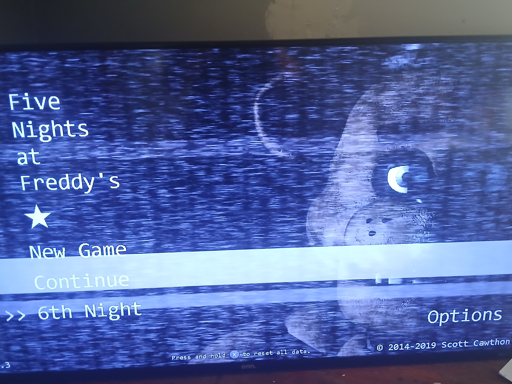

# UGS-Blog-Life
<html>
<html lang="en">
<head>
 
</head>
<body>
  <h1> Welcome to UGS Blog Post </h1>
<h2> Post about your everyday life, a dream, or goals you want to achieve in life don't be shy to share your thoughts </h2>
 <h3> This is my first post on this website.</h3>

 
 On the finale day of Earth Science class the planet Jupiter crashed down to wish us good bye

 <h3> This is my second post on this website</h3>
 
 
 
  On Monday, May 19,2025 I beat the five nights at freddy's on my Nintend switch it was a blast. 
  The last night took my a couple weeks to beat I tried doing it on my own but to no avail so I 
  decided to look up stragtey guide in order to win and they work YIPEEEEEE.
 

 <h3> This is the third post to this website</h3>
 
 
 This was an amazing pack opening on the mobile game pokemon 
  tcg Pocket. I was yelling at the top of my lungs it was very exiting getting this card 
  now I can brag that I got the crow Mew looks very epic to me at least.
 

</body>
</html>

