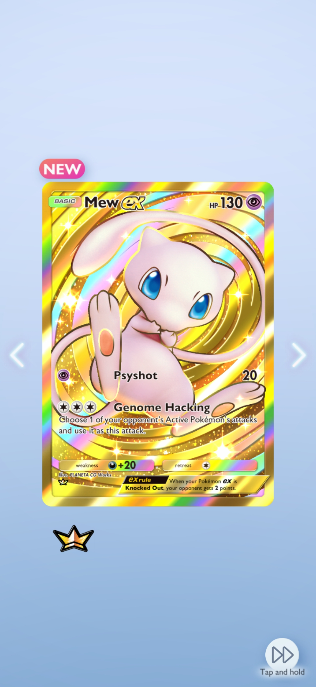

# UGS-Blog-Life
<html>
<html lang="en">
<head>
 
</head>
<body>
  <h1> Welcome to UGS Blog Post </h1>
 
<h2> Post about your everyday life, a dream, or goals you want to achieve in life don't be shy to share your thoughts </h2>
<ol>
 <li> <a href="Sports.html">Sports</a> </li>
 <li><a href="Dreams.html">Dreams</a> </li>
 <li><a href="Life.html"> Life</a> </li>
 <li><a href="Games.html"> Games</a> </li>
</ol>

 <h3> This is my first post on this website.</h3>

 
 On the final day of Earth Science class the planet Jupiter crashed down to wish us good bye. 
  I'm going to miss this class it was fun and exiting big sad.
 

 
 <h3> This is the second post to this website</h3>
 
 
 
 
 This was an amazing pack opening on the mobile game pokemon 
  tcg Pocket. I was yelling at the top of my lungs it was very exiting getting this card 
  now I can brag that I got the crow Mew looks very epic to me at least.
 

 
</body>
</html>

